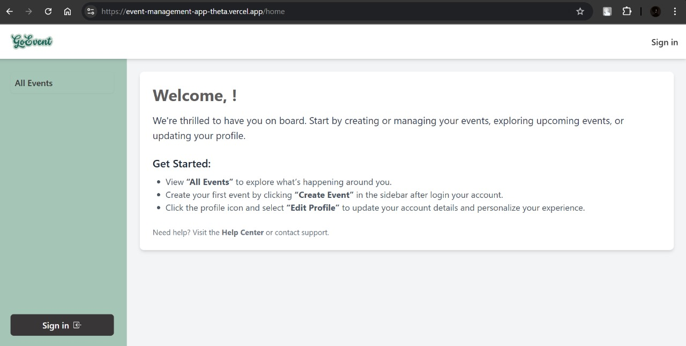

# Event Management Platform

A full-stack web application for managing events, including user registration, login, and event creation. This platform enables users to create, view, edit, and delete events while maintaining user authentication and a responsive user interface.

---

## **Requirements**
- **Node.js** (v20.16.0 or later)
- **npm** (v8.19.4 or later)
- **Database**: MongoDB (for development or MongoDB Atlas for production)
- **JWT** for user authentication

---

## **Features**

### **Core Functionalities**
1. **User Authentication**
   - User Registration with email and password.
   - User Login with encrypted passwords using JWT.
   - Secure password encryption.

2. **Event Management**
   - **Create Event**: Users can create events with a title, description, date, time, and location.
   - **View Events**: All users can view a list of events.
   - **Edit/Delete Event**: Logged-in users can edit or delete their own events.

3. **User Profile**
   - **View/Edit Profile**: Users can update their profile details (username, email).
   - **User Events**: Users can view all events they have created.

4. **Admin**
   - Admin User can edit any event.
   - Admin can change the role of any user.

### **Bonus Features**
- Pagination for event listings.
- Search functionality to filter events by **title** or **location** or **date** or **description**.
- Role-Based Access Control (e.g., Admin can manage all events).

---

## **Setup**

### 1. **Clone the Repository**
```bash
git clone https://github.com/AbdullahSoftech/event-management-app.git
cd event-management-app
```

### 2. **Backend Setup**
Go to **app.js**, replace this
```bash
app.use(cors({
    origin: 'https://event-management-app.vercel.app',
    credentials: true
}))
```
with this

```bash
app.use(cors({
    origin: 'http://localhost:3000',
    credentials: true
}))
```
Navigate to the backend folder:
```bash
cd server
npm install
npm run start
```
Make sure to configure your MongoDB connection string and JWT secret in the `.env` file:
```env
MONGO_URI=your-mongodb-connection-string
JWT_SECRET=your-secret-key
PORT=5000
```

### 3. **Frontend Setup**
Go to **client folder** and replace the
```bash
https://event-management-app.vercel.app
```
everywhere it is used in react with this
```bash
http://localhost:5000
```
Navigate to the frontend folder:
```bash
cd client
npm install
npm start
```
The frontend will start at `http://localhost:3000`.

---

## **Technologies Used**
- **Frontend**: React, Tailwind CSS, axios, react-router-dom
- **Backend**: Node.js, Express, JWT for authentication, bcrypt js for password encryption.
- **Database**: MongoDB (Mongoose ODM)
- **Other**: Git for version control, dotenv for environment variables

---

## **Deployment**
The application is deployed:
- **Backend**: Vercel
- **Frontend**: Vercel



---

## **Future Improvements**
- Implement unit and integration testing.
- Full TypeScript support.

---

### **Contact**
If you have any questions or suggestions, feel free to reach out via:
- **GitHub**: https://github.com/AbdullahSoftech
- **Email**: abdullah.softech@gmail.com

---

**Happy Coding! 🚀**
